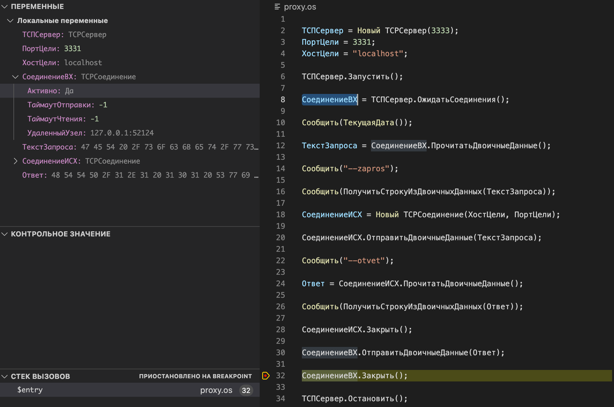
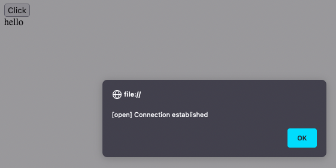
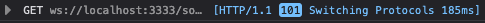
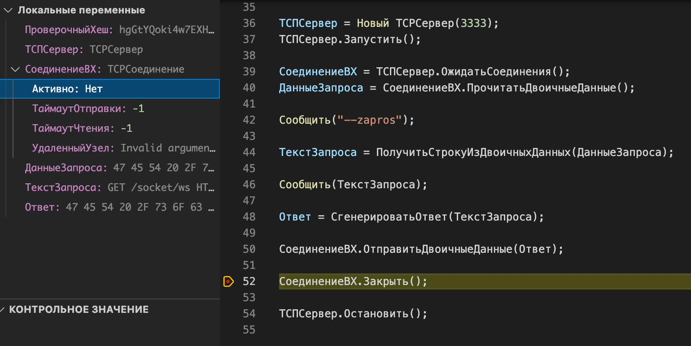
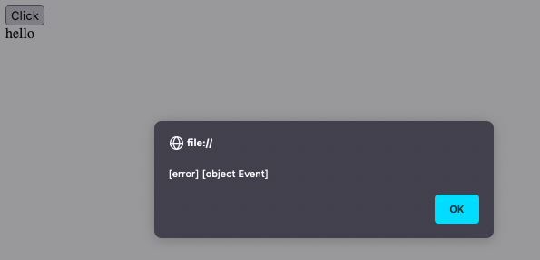
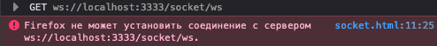
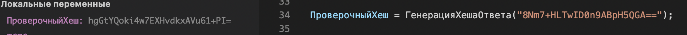

Пример воспроизведения ошибки TCPСоединения.

Все ниже ложно. При хешировании рукопожатия, были лишние символы, СокрЛП решило проблему.

## Вариант рабочий

Сначала я покажу как оно по каким-то причинам все же работает. Порядок такой:

1. Запускаю сервер веб сокетов на nodejs.
~~~
node test.js
~~~

2. Запускаю проксю на oscript
~~~
oscript proxy.os
~~~

3. Открываю в браузере ``` socket.html ```. Жму кнопку ``` Click ```

 

Остановился на строке

```bsl
СоединениеВХ.Закрыть();
```

Соединение у меня Активно, браузер удачно словил рукопожатие.





Я делаю вывод, что условно оскрипт может корректно отправлять пакет.

Вот сообщения

Запрос
```
GET /socket/ws HTTP/1.1
Host: localhost:3333
User-Agent: Mozilla/5.0 (Macintosh; Intel Mac OS X 10.15; rv:107.0) Gecko/20100101 Firefox/107.0
Accept: */*
Accept-Language: ru-RU,ru;q=0.8,en-US;q=0.5,en;q=0.3
Accept-Encoding: gzip, deflate, br
Sec-WebSocket-Version: 13
Origin: null
Sec-WebSocket-Extensions: permessage-deflate
Sec-WebSocket-Key: 8Nm7+HLTwID0n9ABpH5QGA==
DNT: 1
Connection: keep-alive, Upgrade
Sec-Fetch-Dest: websocket
Sec-Fetch-Mode: websocket
Sec-Fetch-Site: cross-site
Pragma: no-cache
Cache-Control: no-cache
Upgrade: websocket
```

Ответ
```
HTTP/1.1 101 Switching Protocols
Upgrade: websocket
Connection: Upgrade
Sec-WebSocket-Accept: hgGtYQoki4w7EXHvdkxAVu61+PI=
```

## Вариант не рабочий, а хочется, что бы был рабочим.

Тут я сделал мини сервер для вебсокета, который должен был бы сгенерировать ответ.

1. Запускаю минисервер
~~~
oscript miniserver.os
~~~

2. Открываю в браузере ``` socket.html ```. Жму кнопку ``` Click ```

 

Остановившись на строке

```bsl
СоединениеВХ.Закрыть();
```

У меня после отправки ответа, соединение НЕ активно. А в браузере ошибка




Запрос

```
GET /socket/ws HTTP/1.1
Host: localhost:3333
User-Agent: Mozilla/5.0 (Macintosh; Intel Mac OS X 10.15; rv:107.0) Gecko/20100101 Firefox/107.0
Accept: */*
Accept-Language: ru-RU,ru;q=0.8,en-US;q=0.5,en;q=0.3
Accept-Encoding: gzip, deflate, br
Sec-WebSocket-Version: 13
Origin: null
Sec-WebSocket-Extensions: permessage-deflate
Sec-WebSocket-Key: fl/VcSryz1v95yiFW/bW7g==
DNT: 1
Connection: keep-alive, Upgrade
Sec-Fetch-Dest: websocket
Sec-Fetch-Mode: websocket
Sec-Fetch-Site: cross-site
Pragma: no-cache
Cache-Control: no-cache
Upgrade: websocket
```

Ответ
```
HTTP/1.1 101 Switching Protocols
Upgrade: websocket
Connection: Upgrade
Sec-WebSocket-Accept: k+83GHvaIoqU5pmE1cHUgsBXsfw=
```

Собственно я не понимаю что за херня, и где рвется. Можно было бы меня пнуть, что я криво хеширую рукопожатие. Но вроде бы нет. Вот проверка функции на данных запроса nodejs



В общем, где тут грабли, по которым мы прыгаем, я понять не могу.
